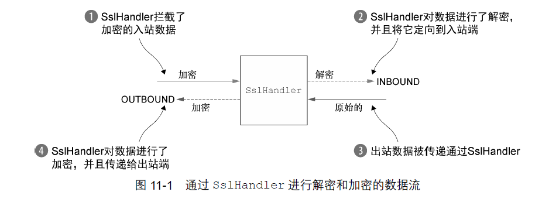
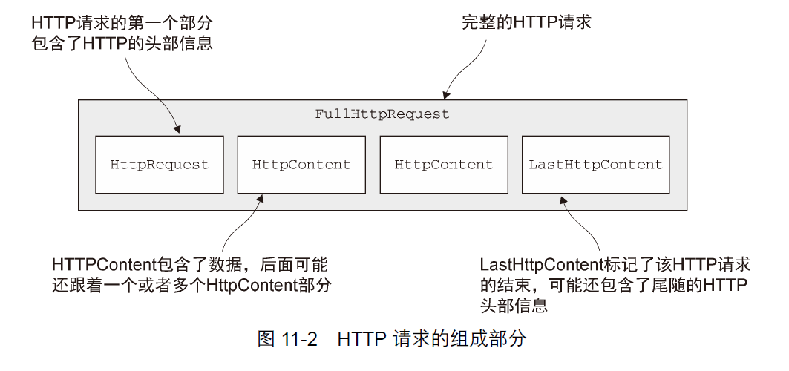
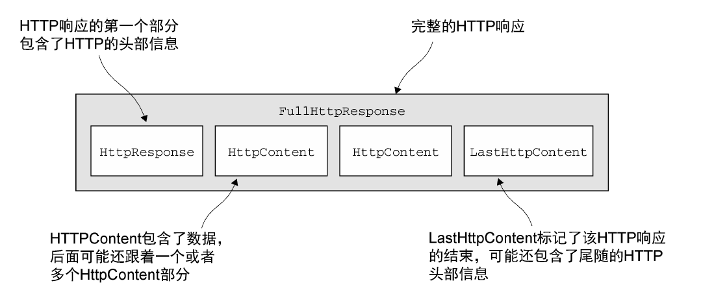
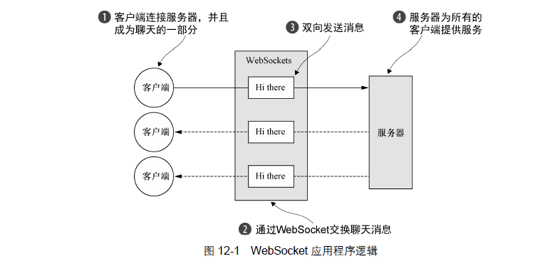
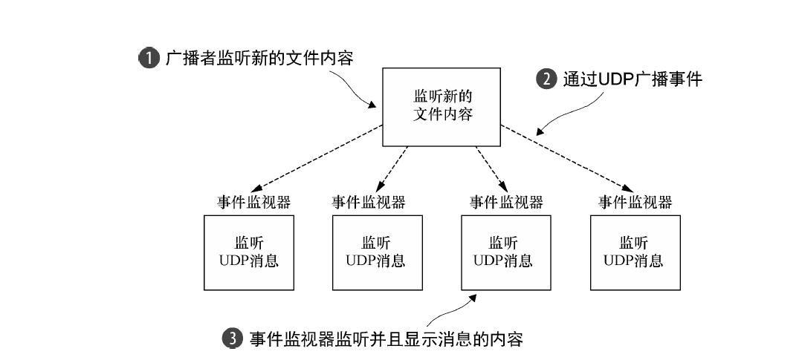

# Netty-Learning
<p align="center"></p>

## Much effort,much prosperity

进度如下<br>
- [x] 【Netty in Action1】 异步和事件驱动
- [x] 【Netty in Action2】 你的第一款Netty应用程序
- [x] 【Netty in Action3】 Netty的组件和设计
- [x] 【Netty in Action4】 传输
- [x] 【Netty in Action5】 ByteBuf
- [x] 【Netty in Action6】 ChannelHandler和ChannelPipeline
- [x] 【Netty in Action7】 EventLoop和线程
- [x] 【Netty in Action8】 引导
- [x] 【Netty in Action9】 单元测试
- [x] 【Netty in Action10】 编解码框架
- [x] 【Netty in Action11】 预置的ChannelHandler和编解码器
- [x] 【Netty in Action12】 WebSocket
- [ ] 【Netty in Action13】 使用UDP广播事件
- [ ] 【Netty in Action14】 案例研究，第一部分
- [ ] 【Netty in Action15】 案例研究，第二部分

```
在传统的Java应用中，通常使用以下4种方式进行跨节点通信。
（1）通过RMI进行远程服务调用
（2）通过Java的Socket+Java序列化的方式进行跨节点调用;
（3）利用一些开源的RPC框架进行远程服务调用，例如Facebook的Thrift,Apache的Avro等；
（4）利用标准的共有协议进行跨节点服务调用，例如HTTP+XML.RESTful+JSON或者WebService.
```

## Netty协议栈功能设计<br/>
## 协议栈功能描述<br/>
Netty协议栈承载了业务内部各模块之间的消息交互和服务调用，它的主要功能如下。
```
*基于Netty的NIO通信框架，提供高性能的异步通信能力;
*提供消息的编解码框架，可以实现POJO的序列化和反序列化;
*提供基于IP地址的白名单接入认证机制;
*链路的有效性校验机制;
*链路的断连重连机制。
```
Netty的数据处理API通过倆个组件暴露- -abstract class ByteBuf和interface ByteBufHolder.<br/>
下面是一些ByteBuf API的优点:
```
(1)它可以被用户自定义的缓冲区类型扩展;
(2)通过内置的复合缓冲区类型实现了透明的零拷贝;
(3)容量可以按需增长（类似于JDK的StringBuilder);
(4)在读和写这倆种模式之间切换不需要调用ByteBuffer的flip()方法;
(5)读和写使用了不同的索引;
(6)支持方法的链式调用;
(7)支持引用计数;
(8)支持池化。
```
## ChannelHandler和ChannelPipeline
<br/>

### ChannelHandler家族

<br/>

### Channel的生命周期

<br/>
Channel的四个状态:
```
状态                        描述
(1)ChannelUnregistered      Channel已经被创建,但还未注册到EventLoop
(2)ChannelRegistered        Channel已经被注册到了EventLoop
(3)ChannelActive            Channel处于活动状态（已经连接到它的远程节点)。它现在可以接受和发送数据了
(4)ChannelInactive          Channel没有连接到远程节点
Channel的生命周期是:
ChannelRegistered- - ->ChannelActive- ->ChannelInactive- ->ChannelUnregistered
```

### ChannelHandler的生命周期

<br/>
在ChannelHandler被添加到ChannelPipeline中或者被从ChannelPipeline中移除时会调用这些操作。这些方法中的每一个都接受一个
<br/>
ChannelHandlerContext参数。
<br/>
ChannelHandler的生命周期方法
```
      类型                            描述
(1)handlerAdded                    当把ChannelHandler添加到ChannelPipeline中时被调用
(2)handlerRemoved                  当从ChannelPipeLine中移除ChannelHandler时被调用
(3)exceptionCaught                 当处理过程中在ChannelPipeLine中有错误产生时被调用
Netty定义了下面2个重要的ChannelHandler子接口:
>+< ChannelInboundHandler - - -处理入站数据以及各种状态变化；
>+< ChannelOutboundHandler - - -处理出站数据并且允许拦截所有的操作。
```

### ChannelInboundHandler接口
 
<br/>

### ChannelOutboundHandler接口

<br/>

### ChannelHandler适配器

<br/>

###  资源管理

```
  每当通过调用ChannelInboundHandler.channelRead()或者ChannelOutboundHandler.write()方法来处理数据时，你都需要确保没有任何的资源泄露
。你可能还记得在前面的章节中所提到的，Netty使用引用计数来处理池化的ByteBuf。所以在完全使用完某个ByteBuf后,调整其引用计数是很重要的。
Netty提供了class ResourceLeakDetector,它将对你应用程序的缓冲区分配做大约1%的采样来检测内存泄漏。相关的开销是非常小的。
  如果检测到了内存泄漏，将会产生类似于下面的日志信息:
详情请看p75  Netty in Action
泄露检测级别 
       级别                  描述
(1)  DISABLED           禁用泄露检测。只有在详尽的测试之后才应设置为这个值
(2)  SIMPLE             使用1%的默认采样率检测并报告任何发现的泄露。这是默认级别，适合绝大部分的情况
(3)  ADVANCED           使用默认的采样率，报告所发现的任何的泄露以及相应的消息被访问的位置
(4)  PARANOID           类似于ADVANCED,但是其将会对每次(对消息的)访问都进行采样。这对性能将会有很大的影响，应该只在调试阶段使用

泄露检测级别可以通过将下面的Java系统属性设置为表中的一个值来定义:
java -Dio.netty.leakDetectionLevel=ADVANCED
```
 ChannelPipeLine接口
```
  每一个新创建的Channel都将会被分配一个新的ChannelPipeline。这项关联是永久性的;Channel既不能
附加另外一个ChannelPipeline,也不能分离其当前的。在Netty组件的生命周期中，这是一项固定的操作，不需要
开发人员的任何干预。
```
 ChannelHandlerContext接口
```
  ChannelHandlerContext代表了ChannelHandler和ChannelPipeline之间的关联，每当有ChannelHandler
添加到ChannelPipeline中时，都会创建ChannelHandlerContext。ChannelHandlerContext的主要功能是管理
它所关联的ChannelHandler和在同一个ChannelPipeline中的其他ChannelHandler之间的交互。
  ChannelHandlerContext有很多的方法，其中一些方法也存在于Channel和ChannelPipeline本身上，但是有一点重要的不同。
如果调用Channel或者ChannelPipeline上的这些方法，它们将沿着整个ChannelPipeline进行传播。而调用位于ChannelHandler
Context上的相同方法，则将从当前所关联的ChannelHandler开始，并且只会传播给位于该ChannelPipeline中的下一个能够处理
该事件的ChannelHandler。
  对ChannelHandlerContext　API进行了总结
     方法名称                           描述
alloc                             返回和这个实例相关联的Channel所配置的ByteBufAllocator
bind                              绑定到给定的SocketAddress,并返回ChannelFuture
channel                           返回绑定到这个实例的Channel
close                             关闭Channel,并返回ChannelFuture
connect                           连接给定的SocketAddress,并返回ChannelFuture
deregister                        从之前分配的EventExecutor注销，并返回ChannelFuture
disconnect                        从远程节点断开，并返回ChannelFuture
executor                          返回调度事件的EventExecutor
fireChannelActive                 触发对下一个ChannelInboundHandler上的channelActive()(已连接)的调用
fireChannelInactive               触发对下一个ChannelInboundHandler上的channelInactive()(已关闭)的调用
fireChannelRead                   触发对下一个ChannelInboundHandler上的channelRead()(已接受的消息)的调用
fireChannelReadComplete           触发对下一个ChannelInboundHandler上的channelReadComplete()方法的调用
fireChannelRegistered             触发对下一个ChannelInboundHandler上的fireChannelRegistered()方法的调用
fireChannelUnregistered           触发对下一个ChannelInboundHandler上的fireChannelUnregistered()方法的调用
fireChannelWritabilityChanged     触发对下一个ChannelInboundHandler上的fireChannelWritabilityChanged()方法的调用
fireExceptionCaught               触发对下一个ChannelInboundHandler上的fireExceptionCaught(Throwable)方法的调用
fireUserEventTriggered            触发对下一个ChannelInboundHandler上的fireUserEventTriggered(Object evt)方法的调用
handler                           返回绑定到这个实例的ChannelHandler
isRemoved                         如果所关联的ChannelHandler已经被从ChannelPipeline中移除则返回true
name                              返回这个实例的唯一名称
pipeline                          返回这个实例所关联的ChannelPipeline
read                              将数据从Channel读取到第一个入站缓冲区;如果读取成功则触发一个channelRead事件，并(在最后一个消息被读取完成后)
                                  通知ChannelInboundHandler的channelReadComplete(channelReadComplete)(ChannelHandlerContext)方法
write                             通过这个实例写入消息并经过ChannelPipeline
writeAndFlush                     通过这个实例写入并冲刷并经过ChannelPipeline

当使用ChannelHandlerContext的API的时候，请牢记以下2点：
  ChannelHandlerContext 和 ChannelHandler之间的关联(绑定)是永远不会改变的，所以缓存对它的应用是安全的;
  如同我们在本节开头所解释的一样，相对于其他类的同名方法，ChannelHandlerContext的开头将产生更短的事件流，
应该尽可能地利用这个特性来获得最大的性能。
```
ChannelHandler和ChannelHandlerContext的高级用法
<br />
描述：

```
  为什么会想要从ChannelPipeline中的某个特定点开始传播事件呢?
为了减少将事件传经对它不感兴趣的ChannelHandler所带来的开销。
为了避免将事件传经那些可能会对它感兴趣的ChannelHandler。
  要想调用从某个特定的ChannelHandler开始的处理过程，必须获取到在(ChannelPipeline)该ChannelHandler之前的ChannelHandler所关联的
ChannelHandelerContext。这个ChannelHandlerContext将调用和它所关联的ChannelHandler之后的ChannelHandler

你可以调用ChannelHandlerContext上的pipeline()方法来获得被封闭的ChannelPipeline的引用。这使得运行时得以操作ChannelPipeline的
ChannelHandler，我们可以利用这一点来实现一些复杂的的设计。例如，你可以通过将ChannelHandler添加到ChannelPipeline中来实现动态的
协议转换。
另一种高级的用法是缓存到ChannelHandlerContext的引用以供稍后使用，这可能会发生在任何的ChannelHandler方法之外，甚至来自于
不同的
因为一个ChannelHandler可以从属于多个ChannelPipeline,所以它也可以绑定到多个ChannelHandlerContext实例。对于这种用法指在多个
ChannelPipeline中共享同一个ChannelHandler,对应的ChannelHandler必须要使用@Sharable注解标注;否则，试图将它添加到多个
ChannelPipeline时将会触发异常。显而易见，为了安全地被用于多个并发的Channel(即连接),这样的ChannelHandler必须是线程安全的。
```

异常处理
- 处理入站异常
- 处理出站异常

```
  你应该如何响应异常，可能很大程度上取决于你的应用程序。你可能想要关闭Channel(和连接)，也可能会尝试进行恢复。如果你不实现
任何处理入站异常的逻辑(或者没有消费改异常)，那么Netty将会记录改异常没有被记录的事实。
总结一下:
   ChannelHandler.execptionCaught()的默认实现是简单地将当前异常转发给ChannelPipeline中的下一个ChannelHandler;
   如果异常到达了ChannelPipeline的尾端，它将会被记录为未被处理；
   要想定义自定义的处理逻辑，你需要重写exceptionCaught()方法。然后你需要决定是否需要将该异常传播出去
   
   
  用于处理出站操作中的正常完成以及异常的选项，都基于以下的通知机制。
每个出站操作都将返回一个ChannelFuture。注册到ChannelFuture的ChannelFutureListener将在操作完成时被通知该操作是成功了还是出错了。
几乎所有的ChannelOutboundHandler上的方法都会传入一个ChannelPromise的实例。作为ChannelFuture的子类,ChannelPromise也可以被分配用于
异步通知的监听器。但是,ChannelPromise还具有提供立即通知的可写方法:
  ChannelPromise setSuccess();
  ChannelPromise setFailure(Throwable cause);

添加ChannelFutureListener只需要调用ChannelFuture实例上的addListener(ChannelFutureListener)方法，并且有2种不同的方式可以做到
这一点。其中最常用的方式是，调用出站操作(如write()方法)所返回的ChannelFuture上的addListener()方法。
```


解码器
- 将字节解码为消息---ByteToMessageDecoder和ReplayingDecoder;
- 将一种消息类型解码为另一种---MessageToMessageDecoder。
<br />
将字节编码为消息(或者另一个字节序列)是一项如此常见的任务。

```

   方法                                          描述
decode(ChannelHandlerContext ctx,            这是你必须实现的唯一抽象方法。decode()方法被调用时将会传入一个包含了传入数据的ByteBUf,
ByteBuf in,List<Object> out)                 以及一个用来添加解码信息的List。对这个方法的调用将会重复进行，直到确定没有新的元素被添加到该
                                             List,或者该ByteBuf中没有更多可读取的字节时为止。然后，如果该List不为空，那么它的内容将会被
                                             传递给ChannelPipeline中的下一个ChannelInboundHandler


decodeLast(                                  Netty提供的这个默认实现只是简单地调用了decode()方法。当Channel的状态变为非活动时，这个
ChannelHandlerContext ctx,                   方法将会被调用一次。可以重写该方法以提供特殊的处理
ByteBuf in,
List<Object> out)    
                                         
```
编码器
- 抽象类MessageToByteEncoder
- 抽象类MessageToMessageEncoder
<hr/>

抽象的编解码器类
<br/>
抽象类ByteToMessageCodec                     

```
  让我们来研究这样的一个场景：我们需要将字节解码为某种形式的消息，可能是POJO，随后再次对它进行编码。
ByteToMessageCodec将为我们处理好这一切，因为它结合了ByteToMessageDecoder以及它的逆向--
MessageToByteEncoder。
   任何的请求/响应协议都可以作为使用ByteToMessageCodec的理想选择。例如，在某个SMTP的实现中，
编解码器将读取传入字节，并将它们解码为一个自定义的消息类型，如smtpRequest.在接受端，当一个响应被创建
时，将会产生一个smtpResponse,其将被编码回字节以便进行传输。
```
抽象类MessageToMessageCodec

```
  你看到了一个扩展了MessageToMessageEncoder以将一种消息格式转换为另外一种消息格式的例子。通过
使用MessageToMessageCodec，我们可以在一个单一的类中实现该转换的往返过程。MessageToMessageCodec
是一个参数化的类，定义如下:
public abstract class MessageToMessageCodec<INBOUND_IN,OUTBOUND_IN>
```

CombinedChannelDuplexHandler类

```
  结合一个解码器和编码器可能会对可重用性造成影响。但是，有一种方法既能够避免这种惩罚，又不会牺牲将一个解码器和一个编码器作为一个
单元的单元部署所带来的便利性。CombinedChannelDuplexHandler提供了这个解决方案,其声明为:
 public class CombinedChannelDuplexHandler
 <I extends ChannelInboundHandler,O extends ChannelOutboundHandler>
```
 EventLoop和线程模型
- 线程模型概述
- 事件循环的概念和实现
- 任务调度
- 实现细节


子类的声明如下:

```
public class Bootstrap
   extends AbstractBootstrap<Bootstrap,Channel>
```
和
```
public class ServerBootstrap
   extends AbstractBootstrap<ServerBootstrap,ServerChannel>
```

引导客户端和无连接协议
Bootstrap类被用于客户端或者使用了无连接协议的应用程序中。

```
   名称                                       描述
Bootstrap group(EventLoopGroup)        设置用于处理Channel所有事件的EventLoopGroup
                                       
Bootstrap channel(                     channel()方法指定了Channel的实现类。如果该实现
    class<?,extends c>)                类没提供默认的构造函数，可以通过调用channelFactory()
Bootstrap channelFactory(              方法来指定一个工厂类,它将会被bind()方法调用
    ChannelFactory<? extends C>)
    
Bootstrap localAddress(                指定Channel应该绑定到的本地地址。如果没有指定，则将由
    SocketAddress)                     操作系统创建一个随机的地址。或者，也可以通过bind()或者
                                       connect()方法指定localAddress
    
<T> Bootstrap option(                  设置ChannelOption,其将应用到每个新创建的Channel的
    ChannelOption<T> option,           ChannelConfig。这些选项将会通过bind()或者connect()
    T value)                           设置到Channel,不管哪个先被调用。这个方法在Channel已经
                                       被创建后再调用将不会有任何的效果。支持的ChannelOption取决于
                                       使用的Channel类型。
                                       
<T> Bootstrap attr(                    指定新创建的Channel的属性值。这些属性值是通过bind()或者
    Attribute<T> key,T value)          connect()方法设置到Channel的。具体取决于谁最先被调用。这个
                                       方法在Channel被创建后将不会有任何的效果
 
Bootstrap                              设置将被添加到ChannelPipeline以接受事件通知的ChannelHandler
handler(ChannelHandler)


Bootstrap clone()                      创建一个当前Bootstrap的克隆,其具有和原始的Bootstrap相同的设置信息

Bootstrap remoteAddress(               设置远程地址。或者，也可以通过connect()方法来指定它
   SocketAddress)
   
ChannelFuture connect()                连接到远程节点并返回一个ChannelFuture,其将会在连接操作完成后接受到通知

ChannelFuture bind()                   绑定Channel并返回一个ChannelFuture,其将会在绑定操作完成后接受到通知，
                                        在那之后必须调用Channel.connect()方法来建立连接
```

引导服务器

```
名称                                              描述
group                                  设置ServerBootstrap要用的EventLoopGroup。这个EventLoopGroup将用于ServerChannel
                                       和被接受的子channel的I/O处理

channel                                设置将要被实例化的ServerChannel类

channelFactory                         如果不能通过默认的构造函数创建Channel,那么可以提供一个ChannelFactory

localAddress                           指定ServerChannel应该绑定到的本地地址。如果没有指定，则将有操作系统使用一个随机地址。或者，
                                       可以通过bind()方法来指定该localAddress

option                                 指定要应用到新创建的ServerChannel的ChannelConfig的ChannelOption。这些选项将会通过bind()
                                       方法设置到Channel。在bind()方法被调用之后，设置或者改变ChannelOption都不会有任何的效果。所支持
                                       的ChannelOption都不会有任何的效果。所支持的ChannelOption取决于所使用的Channel类型。
                                       
childOption                            指定当子Channel被接受时，应用到子Channel的ChannelConfig的ChannelOption。所支持的ChannelOption
                                       取决于所使用的Channel的类型。参见正在使用的ChannelConfig的API文档
                                       
attr                                   指定ServerChannel上的属性，属性将会通过bind()方法设置给Channel。在调用bind()方法之后改变它们将不会
                                       有任何的效果
                                       
childAttr                              将属性设置给已经被接受的子Channel。接下来的调用将不会有任何的效果

handler                                设置被添加给ServerChannel的ChannelPipeline中的ChannelHandler。

childHandler                           设置将被添加到已将接受的子Channel的ChannelPipeline中的ChannelHandler。handler()方法和childHander()
                                       方法之间的区别是:前者所添加的ChannelHandler由接受子Channel的ServerChannel处理，而childHandler()方法所
                                       添加的ChannelHandler将由已被接受的子Channel处理，其代表一个绑定到远程节点的套接字
                                       
clone                                  克隆一个设置和原始的ServerBootstrap相同的ServerBootstrap

bind                                   绑定ServerChannel并且返回一个ChannelFuture，其将会在绑定操作完成后收到通知(带着成功或者失败的结果)
```

## 单元测试
ChannelHandler是Netty应用程序的关键元素，所以彻底地测试它们应该是你的开发过程的一个标准部分。最佳实践要求你的测试不仅要能够证明你的实现是正确的，
<br/>
而且还要能够很容易地隔离那些因修改代码而突然出现的问题。这种类型的测试叫做单元测试。
<br/>
虽然单元测试没有统一的定义，但是大多数的从业者都有基本的共识。其基本思想是,以可能小的区块测试你的代码，并且尽可能地和其他的代码模块以及运行时的依赖
<br/>
(如数据库和网络)相隔离。如果你的应用程序能通过测试验证每个单元本身都能够正常的工作，那么在出了问题时将可以更加容易地找出根本原因。
<br/>
在本章中，我们将学习一种特殊的Channel实现--EmbeddedChannel,它是Netty专门为改进针对ChannelHandler的单元测试而提供的。
<br/>
因为正在被测试的代码模块或者单元将在它正常的运行时环境之外被执行，所以你需要一个框架或者脚手架以便在其中运行它。在我们的例子中。我们将使用JUnit4
<br/>
作为我们的测试框架，所以你需要对它的用法有一个基本的了解。如果它对你来说比较陌生，不要害怕；虽然它功能强大，但却很简单，

```
  Netty提供了它所谓的Embedded传输，用于测试ChannelHandler。这个传输是一种特殊的Channel实现 - -EmbeddedChannel- -的功能，这个实现提供了通过ChannelPineline
传播事件的简便方法。
  这个想法是直截了当的:将入站数据或者出站数据写入到EmbeddedChannnel中，然后检查是否有任何东西到达了ChannelPipeline的尾端。以这种方式，你便可以确定消息是否
已经被编码或者被解码过了，以及是否触发了任何的ChannelHandler动作。
下表列出了EmbeddedChannel的相关方法。
名称                                                职责
writeInbound(                            将入站信息写到EmbeddedChannel中。如果可以通过readInbound()方法从EmbeddedChannel中读取数据，则返回true
     Object.....msgs)

readInbound()                           从EmbeddedChannel中读取一个入站信息。任何返回的东西都穿越了整个ChannelPipeline。如果没有可供读取的东西，则返回null

writeOutbound(                          将出站消息写到EmbeddedChannel中。如果现在可以通过readOutbound()方法从EmbeddedChannel中读取到什么东西，则返回true
     Object ... msgs)                  

readOutbound()                          从EmbeddedChannel中读取一个出站消息。任何返回的东西都穿越了整个ChannelPipeline。如果没有任何可供读取的，则返回null

finish()                                将EmbeddedChannel标记为完成，并且如果有可被读取的入站数据或者出站数据，则返回true。这个方法还将会调用EmbeddedChannel上的
                                        close()方法


    入站数据由ChannelInboundHandler处理，代表从远程节点读取的数据。出站数据由ChannelOutboundHandler处理，代表将要写到远程节点的数据
根据你要测试的ChannelHandler,你将使用*Inbound()或者*Outbound(）方法对，或者兼而有之。
    使用EmbeddedChannel的方法，数据是如何流经ChannelPipeline的。你可以使用writeOutbound()方法将消息写到Channel中，并通过ChannelPipeline沿着出站的方向传递。随后，
你可以使用readOutbound()方法来读取已被处理过的消息，以确定结果是否和预期一样。类似地，对于入站数据，你需要使用writeInbound()和readInbound()方法。
    在每种情况下，消息都将会传递过ChannelPipeline,并且被相关的的ChannelInboundHandler或者ChannelOutboundHandler处理。如果消息没有被消费，那么你可以使用readInbound()
或者readOutbound()方法来在处理过了这些消息之后，酌情把它们从Channel中读出来。
```
## 预置的ChannelHandler和编解码器

通过SSL/TLS保护Netty应用程序]

```

   我们应该熟悉像SSL和TLS这样的安全协议，它们层叠在其他协议之上，用以实现数据安全。我们在访问安全网站时遇到过这些协议，
但是它们也可用于其他不是基于HTTP的应用程序，如安全SMTP(SMTPS)邮件服务器甚至是关系型数据库。
   为了支持SSL/TLS,Java提供了Javax.net.ssl包，它的SSLContext和SSLEngine类使得实现解密和加密相当简单直接。Netty通过一个名
为SslHandler的ChannelHandler实现利用了这个API,其中SslHanlder在内部使用SSLEngine来完成实际的工作。
   Netty的OpenSSL/SSLEngine实现
   Netty还提供了使用了OpenSSL工具包(www.openssl.org)的SSLEngine实现。这个OpenSslEngine类提供了比JDK提供的SSLEngine实现更
好的性能。
   如果OpenSSL库可用，可以将Netty应用程序(客户端和服务器)配置为默认使用OpenSslEngine。如果不可用，Netty将会回退到JDK实现。
有关配置OpenSSL支持的详细说明，参见Netty文档:
   注意,无论你使用JDK的SSLEngine还是使用Netty的OpenSslEngine,SSL API和数据流都是一致的。
   在大多数情况下，SslHandler将是ChannelPipeline中的第一个ChannelHandler。这确保了只有在所有其他的ChannelHandler将它们的
逻辑应用到数据上，才会进行加密。
   SslHandler具有一些有用的方法，例如，在握手阶段，2个节点将相互验证并且商定一种加密方式。你可以通过配置SslHandler来修改
它的行为，或者在SSL/TLS握手一旦完成之后提供通知，握手阶段完成之后，所有的数据都将会被加密，SSL/TLS握手将会被自动执行。
                                    SslHandler的方法
        方法名称                                                            描述
setHandshakeTimeout(long,TimeUnit)                               设置和获取超时时间，超时之后，握手ChannelFuture将会
setHandshakeTimeoutMillis(long)                                  被通知失败
getHandshakeTimeoutMillis()

setCloseNotifyTimeout(long,TimeUnit)                             设置和获取超时时间，超时之后，将会触发一个关闭通知并
setCloseNotifyTimeoutMillis(long)                                关闭连接。这也将会导致通知该ChannelFuture失败
getCloseNotifyTimeoutMillis()

handshakeFuture()                                                返回一个在握手完成后将会得到通知的ChannelFuture.如果握手
                                                                 先前已经执行过了,则返回一个包含了先前的握手结果的
                                                                 ChannelFuture

close()
close(ChannelPromise)    
close(ChannelHandlerContext,ChannelPromise)                      发送close_notify以请求关闭并销毁底层的SslEngine                                                             

```
OpenSSL图：
<p align="center"></p>

<br/>
<br/>
构建基于Netty的HTTP/HTTPS应用程序

```
  HTTP是基于请求/响应模式的:客户端向服务器发送一个HTTP请求，然后服务器将会返回一个HTTP响应
                       HTTP解码器和编码器
名称                                                        描述
HttpRequestEncoder                          将HttpRequest,HttpContent和LastHttpContext消息解码为字节
HttpResponseEncoder                         将HttpResponse,HttpContext和LastHttpContext消息解码为字节
HttpRequestDecoder                          将字节解码为HttpRequest,HttpContext和LastHttpContext消息
HttpResponseDecoder                         将字节解码为HttpResponse,HttpContext和LastHttpContext消息


HTTP压缩
  当使用HTTP时，建议开启压缩功能以尽可能多地减少传输数据的大小，虽然压缩会带来一些CPU时钟周期上的开销，但是通常来说
它都是一个好主意，特别是对于文本数据来说
  Netty为压缩和解压缩提供了ChannelHandler实现，它们同时支持gzip和deflate编码

```
HTTP请求图:
<p align="center"></p>
HTTP响应图:
<p align="center"></p>

#### WebSocket

```
  WebSocket解决了一个长期存在的问题:既然底层的协议(HTTP)是一个请求/响应模式的交互序列，那么如何实时地发布消息呢?AJAX提供了
一定程度上的改善，但是数据流任然是由客户端所发送的请求驱动的。还有其他的一些或多或少的取巧方式，但是最终它们任然属于扩展性受限的变
通之法。
  WebSocket规范以及它的实现代表了对一种更加有效的解决方案的尝试。简单地说，WebSocket提供了"在一个单个的TCP连接上提供双向的通信
......结合WebSocketAPI......它为网页和远程服务器之间的双向通信提供了一种替代HTTP轮询的方案。  "
  也就是说，WebSocket在客户端和服务器之间提供了真正的双向数据交换。我们不会深入地描述太多的内部细节，但是我们还是应该提到，尽管最早
的实现仅限于文本数据，但是现在已经不是问题了；WebSocket现在可以用于传输任意类型的数据，很像普通的套接字。
  
  空闲的连接和超时
  到目前为止，我们的讨论都集中在Netty通过专门的的编解码器和处理器对HTTP的变型HTTPS和WebSocket的支持上。只要你有效地管理你的网络资源，
这些技术就可以使得你的应用更加高效,易用和安全。所以，让我们一起来探讨下首先需要关注的---连接管理吧。  
                              用于空闲连接以及超时的ChannelHandler
  名称                                                  描述
IdleStateHandler                    当连接空闲时间太长时，将会触发一个IdleStateEvent事件。然后，你可以通过在你的ChannelInbound
                                    Handler中重写userEventTriggered()方法来处理该IdleStateEvent事件
                                    
ReadTimeoutHandler                  如果在指定的时间间隔内没有收到任何的入站数据，则抛出一个ReadTimeoutException并关闭对应的Channel
                                    。可以通过重写你的ChannelHandler中的exceptionCaught()方法来检测该ReadTimeOutException
                                    
WriteTimeoutHandler                  如果在指定的时间间隔内没有任何出站数据写入，则抛出一个WriteTimeoutException并关闭对应的Channel
                                     。可以通过重写你的ChannelHandler的exceptionCaught()方法检测该WriteTimeoutException                               
```

#### 基于分割符的协议+基于长度的协议+写大型数据

```
   基于分隔符的消息协议使用定义的字符来标记的消息或者消息段(通常被称为帧)的开头或者结尾。由RFC文档正式定义的许多协议(如SMTP,POP3,IMAP
以及Telnet)都是这样的。此外，当然，私有组织通常也拥有他们自己的专有格式，无论你使用什么样的协议，表中列出的解码器都能帮助你定义可以提取由
任意标记(token)序列分隔的帧的自定义解码器。
                用于处理基于分隔符的协议和基于长度的协议的解码器
名称                                                描述
DelimiterBasedFrameDecoder                  使用任何由用户提供的分隔符来提取帧的通用解码器
LineBasedFrameDecoder                       提取由行尾符(\n或者\r\n)分隔的帧的解码器。这个解码器比DelimiterBasedFrameDecoder更快 
                
   基于长度的协议通过将它的长度编码到帧的头部来定义帧，而不是使用特殊的分隔符来标记它的结束。表中列出了Netty提供的用于处理这种类型的协议的
2中解码器
                 用于基于长度的协议的解码器
名称                                                 描述
FixedLengthFrameDecoder                      提取在调用构造函数时指定的定长帧
LengthFieldBasedFrameDecoder                 根据编码进帧头部中的长度值提取帧；该字段的偏移量以及长度在构造函数中指定

因为网络饱和的可能性，如果在异步框架中高效地写大块的数据是一个特殊的问题。由于写操作是非阻塞的，所以即使没有写出所有的数据，写操作也会在完成时
返回并通知ChannelFuture。当这种情况发生时，如果任然不停地写入，就有内存耗尽的风险。所以在写大型数据时，需要准备好处理到远程节点的连接是
慢速连接的情况,这种情况会导致内存释放的延迟。让我们考虑下将一个文件内容写到网络的情况。
   在我们讨论传输的过程中，提到了NIO的零拷贝特性，这种特性消除了将文件的内容从文件系统移动到网络栈的复制过程。所有的这一切都发生在Netty
的核心中，所以应用程序所有需要做的就是使用一个FileRegion接口的实现，其在Netty的API文档中定义是: "通过支持零拷贝的文件传输的Channel来发送的
文件区域"  
   关键是interface ChunkedInput<B>,其中类型参数B是readChunk()方法返回的类型。Netty预置了该接口的4个实现，每个都代表了一个将由Chunked
-WriteHandler处理的不定长度的数据流。
   下表中说明了ChunkedStream的用法，它是实践中最常用的实现。所示的类使用了一个File以及一个SslContext进行实例化。当initChannel()方法被
调用时，它将使用所示的ChannelHandler链初始化该Channel。
                                ChunkedInput的实现
名称                                           描述
ChunkedFile                     从文件中逐块获取数据，当你的平台不支持零拷贝或者你需要转换数据时使用
ChunkedNioFile                  和ChunkedFile类似，只是它使用了FileChannel
ChunkedStream                   从InputStream中逐块传输内容
ChunkedNioStream                从ReadableByteChannel中逐块传输内容               
```

### WebSocket

```
  如果你有跟进Web技术的最新发展，你很可能就遇到过"实时Web"这个短语，而如果你在工程领域中有实时应用程序的实战经验，那么你可能有点怀疑这个
术语到底意味什么。
  因此，让我们首先澄清，这里并不是指所谓的硬实时服务质量(QoS),硬实时服务质量是保证计算结果将在指定的时间间隔内被递交。仅HTTP的请求/响应
模式设计就使得其很难被支持，从过去所设计的各种方案中都没有提供一种能够提供令人满意的解决方案的事实中便可见一斑。
  虽然已经有了一些关于正式定义实时Web服务语义的学术讨论，但是被普通接受的定义似乎还未出现。因此现在我们将采纳下面来自维基百科的非权威性描述：
  实时Web利用技术和实践，使用户在信息的作者发布信息之后就能够立即收到信息，而不需要他们或者他们的软件周期性地检查信息源以获取更新。
  简而言之，虽然全面的实时Web可能并不会马上到来，但是它背后的想法却助长了对于几乎瞬间获得信息的期望。我们将在本章中讨论的WebSocket协议
便是在这个方向上迈出的坚实的一步。 
  由IETF发布的WebSocketRFC,定义了6种帧，Netty为它们每种都提供了一个POJO实现。下表中列出了这些帧类型，并描述了它们的用法。
                                 WebSocketFrame的类型
  帧类型                                                     描述
BinaryWebSocketFrame                                 包含了二进制数据
TextWebSocketFrame                                   包含了文本数据
ContinuationWebSocketFrame                           包含属于上一个BinaryWebSocketFrame或TextWebSocketFrame的文本数据或者二进制数据
CloseWebSocketFrame                                  表示一个CLOSE请求，包含一个关闭的状态码和关闭的原因
PingWebSocketFrame                                   请求传输一个PongWebSocketFrame
PongWebSocketFrame                                   作为一个对于PingWebSocketFrame的响应被发送   

通过安装所有必需的ChannelHandler来设置该新注册的Channel的ChannelPipeline。这些ChannelHandler以及它们各自的职责都被总结在了下表中。
                           基于WebSocket聊天服务器的ChannelHandler
ChannelHandler                                                  职责
HttpServerCodec                                    将字节解码到HttpRequest,HttpContent和LastHttpContent。并将HttpRequest,Http
                                                   Content和LastHttpContent编码为字节
ChunkedWriteHandler                                写入一个文件的内容
HttpObjectAggregator                               将一个HttpMessage和跟随它的多个HttpContent聚合为单个FullHttpRequest或者Full
                                                   HttpResponse(取决于它是被用于处理请求还是响应）。安装了这个之后，ChannelPipeline
                                                   中的下一个ChannelHander将只会收到完整的HTTP请求或响应
HttpRequestHandler                                 处理FullHttpRequest(那些不发送到/wsURI的请求）
TextWebSocketFrameHandler                          处理TextWebSocketFrame和握手完成事件                                                   
                                                   
  Netty的WebSocketServerProtocolHandler处理了所有委托管理的WebSocket帧类型以及升级握手本身。如果握手成功，那么所需的ChannelHandler 
将会被添加到ChannelPipeline中，而那些不在需要的ChannelHandler则将会被移除。
  WebSocket协议升级之前的ChannelPipeline的状态，这代表了刚刚被ChatServerInitializer初始化之后的ChannelPipeline.
                                                      ChannelPipeline
HttpRequestDecoder  HttpResponseEncoder HttpObjectAggregator HttpRequestHandler WebSocketProtocolHandler TextWebSocketFrameHandler
  当WebSocket协议升级完成之后，WebSocketServerProtocolHandler将会把HttpRequestDecoder替换为WebSocketFrameDecoder,把HttpResponse
Encoder替换为WebSocketFrameEncoder。为了性能最大化，它将移除任何不在被WebSocket连接所需要的ChannelHandler。这也包括了所示的HttpObject
Aggregator和HttpRequestHandler。
  下图展示了这些操作完成之后的ChannelPipeline。需要注意的是，Netty目前支持4个版本的WebSocket协议，它们每个都具有自己的实现类。Netty将会
根据客户端(这里值浏览器)所支持的版本，自动地选择正确版本的WebSocketFrameDecoder和WebSocketFrameEncoder  
                                                    ChannelPipeline
                                                    
                                                    
WebSocketFrameDecoder13 WebSocketFrameEncoder13 WebSocketServerProtocolHandler TextWebSocketFrameHandler                                                    
```

下图说明了该应用程序的逻辑:<br/>
(1)客户端发送一个消息；<br/>
(2)该消息将被广播到所有其他连接的客户端。<br/>
<p align="center"></p>

## 使用UDP广播事件

```
  UDP的基础知识
  面向连接的传输(如TCP)管理了2个网络端点之间的连接的建立，在连接的生命周期内的有序和可靠的消息传输，以及最后，连接的有序终止。相比之下，
在类似于UDP这样的无连接协议中，并没有持久化连接这样的概念,并且每个消息(一个UDP数据报)都是一个单独的传输单元。
  此外，UDP也没有TCP的纠错机制，其中每个节点都将确认它们所接受到的包，而没有被确认的包将会被发送方重新传输。
  通过类似，TCP连接就像打电话，其中一系列的有序消息将会在2个方向上流动。相反，UDP则类似于往邮箱中投入一叠明信片。你无法知道它们将以何种
顺序到达它们的目的地，或者它们是否所有的都能够到达它们的目的地。
  UDP的这些方面可能会让你感觉到严重的局限性，但是它们也解释了为何它会比TCP快那么多：所有的握手以及消息管理机制的开销都已经被消除了。
显然，UDP很适合那些能够处理或者容忍消息丢失的应用程序，但可能不适合那些处理金融交易的应用程序。


  UDP广播
  到目前为止，我们所有的例子采用的都是一种叫做单播的传输模式，定义为发送消息给一个由唯一的地址所标识的单一的网络目的地。面向连接的协议和
无连接协议都支持这种模式。
  UDP提供了向多个接受者发送消息的额外传输模式:
  多播---传输到一个预定义的主机组;
  广播---传输到网络(或者子网)上的所有主机。
  
  UDP示例应用程序
  我们的示例程序将打开一个文件，随后将会通过UDP把每一行都作为一个消息广播到一个指定的端口。如果你熟悉类UNIX操作系统，你可能会认识到这是
标准的syslog使用程序的一个非常简化的版本。UDP非常适合于这样的应用程序，因为考虑到日志文件本身已经被存储在了文件系统中，因此，偶尔丢失
日志文件中的1-2行是可以容忍的。此外，该应用程序还提供了极具价值的高效处理大量数据的能力。
  接受方是怎么样的呢?通过UDP广播，只需简单地通过在指定的端口上启动一个监听程序，便可以创建一个事件监听器来接受日志消息。需要注意的是，这样
的轻松访问性也带来了潜在的安全隐患，这也就是为何在不安全的环境中并不倾向于使用UDP广播的原因之一，处于同样的原因，路由器通常也会阻止广播消息，
并将它们限制在它们的来源网络上。
  发布/订阅模式 类似于syslog这样的应用程序通常会被归类为发布/订阅模式:一个生产者或者服务发布事件，而多个客户端进行订阅以接受它们。下图中
展示了整个系统的一个高级别视图，其由一个广播者以及一个或者多个事件监视器组成。广播者将监听新内容的出现，当它出现时，则通过UDP将它作为一个
广播消息进行传输。
  所有的在该UDP端口上监听的事件监视器都将会接受到广播消息。
  为了简单起见，我们将不会为我们的示例程序添加身份认证，验证或者加密。但是，要加入这些功能并使得其成为一个健壮的，可用的实用程序应该也不
难。  
```
<p align="center"></p>